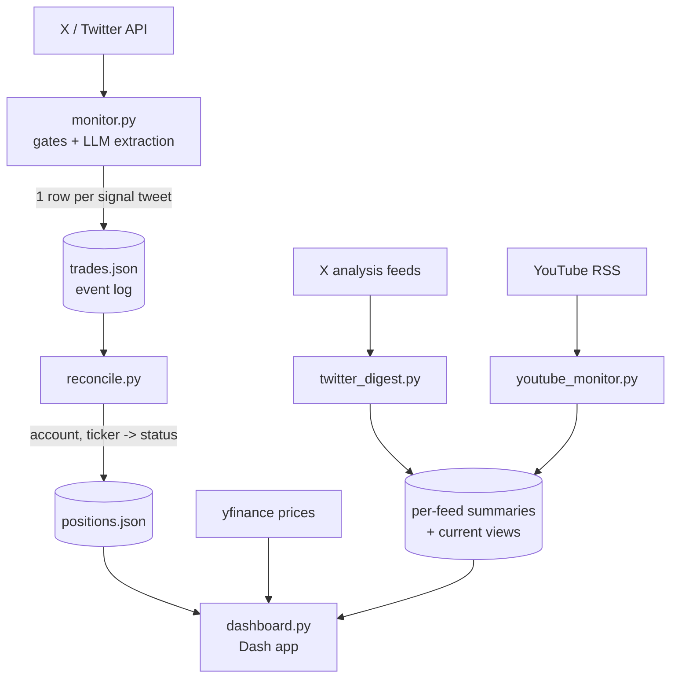

# Pilot Trader

**An LLM-driven trade-call tracker and market-research aggregator.** It watches
finance influencers on X (Twitter), uses large language models to extract
structured trade signals from their posts, tracks how those calls actually
resolve against real prices, and serves a live dashboard alongside
analysis-only research digests of on-chain and macro analysts on X and YouTube.

> ⚠️ **Tracking and research only — no real money, no orders are ever placed,
> not financial advice.** See the [Disclaimer](#disclaimer).

---

## Why I built it

This started as a personal experiment: *can an LLM reliably turn messy,
free-form social-media posts into structured trade signals — and do the people
posting them actually call the market as well as they seem to?*

It became a sandbox for learning a lot of things end to end:

- **LLM structured extraction** — schema-constrained prompting, vision models for
  reading chart screenshots, native video reading, cost control via
  deduplication and pre-LLM gating.
- **Signal evaluation** — resolving each call against real price history
  (target hit / stopped out / expired) instead of taking claimed track records
  at face value.
- **Production-style ops** — Dockerized services, cron pipelines, health checks,
  outage alerting, and a self-hosted dashboard.

Nothing here places orders. The goal was to learn and to satisfy my own
curiosity, not to give or follow investment advice.

---

## Features

**Trade-call tracking** (two public human trade-call accounts on X)

- **Source-grounded signal types** - distinguishes prospective setups, explicit
  execution/holding disclosures, recaps and commentary; captures multiple assets
  and own-thread updates without inventing fills or inheriting earlier prices.
  Ambiguous records stay in a review state instead of becoming trades.
- **LLM signal extraction** - each tweet is read by Google Gemini under a strict
  JSON schema, yielding ticker, direction, sizing, entry, stop/target, thesis,
  and the *actual trade date* (posts often recap older trades).
- **Vision pass** - posts with chart images get a second vision-model pass that
  fills gaps the text did not cover; text always wins, and a chart alone can
  create a setup but never a confirmed holding.
- **Honest evaluation** - each call is resolved against real daily price history
  (target hit / stopped out / expired). Calls whose levels were already invalid
  when made are excluded from win-rate statistics. The headline number is a
  five-session next-open "copy test" replay with matched QQQ/BTC benchmarks and
  a stated 20bp round-trip cost assumption; barrier success is secondary.

**Analysis-only research digests** (never traded)

- **X feeds** - eight per-post feeds (on-chain, macro and technical analysts),
  each with its own ledger and persona prompt, plus an optional chart-vision
  pass. One feed uses a stricter pre-LLM market-signal gate to filter promo and
  off-topic posts.
- **Forecast ledger** - a topic search clusters the same crypto price call
  echoed by dozens of outlets into one row per forecast; the dashboard grades
  each as reached / missed / still open against live price.
- **YouTube** - three channels are read natively by Gemini (the video URL is
  handed straight to the model in agentic video mode, no local download or
  transcript). One Hungarian-language channel gets per-chapter summaries,
  timestamp links and up to three real frames from the video, and only its
  latest two uploads are ever processed.
- **Consensus view** - every analyst's rolling "current view" (sentiment,
  freshness, stance) side by side, grouped by asset class, with a 60-day
  sentiment-balance chart and a map of the BTC price levels each analyst is
  watching. Every view is also appended to an append-only history log.

**Dashboard and operations**

- **Live dashboard** - a dark-themed Dash app: one flat tab bar (Consensus
  landing page, one tab per trade-call account, forecast table), a sticky
  status bar (API credit runway, LLM spend across all pipelines, price
  freshness), "new since your last visit" badges, and a background cache warmer
  that refreshes data ahead of expiry so page loads never fetch.
- **Failure handling** - digest inputs are persisted before analysis and
  acknowledged only after outputs commit, so a crash repeats work rather than
  losing it. Total-LLM-outage detection, corrupted-text detection with retry,
  and per-run cost logging are built in.
- **Cost-aware by design** - high-water-mark deduplication, pre-LLM gating,
  cheap real-time Gemini calls, and a cheaper third-party tweet source keep the
  monthly LLM/API spend in the low-single-digit-dollar range.

> **Note:** earlier versions of this project also tracked AI-run portfolio bots
> and mirrored their trades to an Interactive Brokers paper account. Both were
> retired in August 2026 (the upstream accounts went dead), and the strategy
> mining and outbound-notification features were retired in September 2026;
> the code lives on in git history. Everything monitored today is a human
> trade-call or analysis-only account.

---

## Architecture



**Pipeline in words:**

1. `monitor.py` fetches new tweets, applies pre-LLM gates (retweet/reply
   dedup, language and content filters, high-water-mark skipping), then runs
   text (and optional vision) extraction into a strict schema.
2. Each extracted signal is appended to `trades.json` (an append-only event log).
3. `reconcile.py` folds the event log into `positions.json` — a current view
   keyed by `(account, ticker)` with open/closed status and sizing; earlier
   trading cycles of the same ticker are retained under stable cycle IDs.
4. `resolver.py` / `evaluation.py` resolve calls against daily price history
   and run the five-session replay; `dashboard.py` renders the results and the
   research digests.

Separate, **never-traded** pipelines (`youtube_monitor.py`, `twitter_digest.py`) produce analysis-only research summaries shown in the
dashboard. Each keeps its own append-only ledger, which doubles as its
deduplication set, so re-runs are idempotent.

MakeItCount's chapter and frame enrichment requires `yt-dlp` in the host
environment and FFmpeg on `PATH`. If that enrichment is unavailable, the
video summary still appears with topic sections and any identified timestamp
links. Selected frame images are stored under `data/video_frames/` and
served by the dashboard.

---

## Tech Stack

| Area | Tools |
|------|-------|
| Language | **Python 3.12** |
| LLM | **Google Gemini** — `gemini-2.5-flash-lite` for text extraction and cheap triage, `gemini-3.7-flash` for vision, long-form analysis and native video, via the real-time Gemini API (schema-constrained JSON) |
| Dashboard | **Dash / Plotly** (dark, GitHub-style theme) |
| Market data | **yfinance** (prices), RSS (YouTube detection) |
| Data sources | Third-party X/Twitter APIs; YouTube videos read natively by Gemini; MakeItCount chapter metadata and selected real frames fetched with yt-dlp / FFmpeg |
| Packaging / ops | **Docker** + Docker Compose (dashboard runs non-root, read-only repo mount, all capabilities dropped, no Docker socket), cron pipelines, health checks |
| Storage | Plain JSON event logs + state files (no database) |
| Diagnostics | Local logs, exit codes and dashboard freshness indicators |

---

## Screenshots

> _Screenshots coming soon._

<!--
Add images here, e.g.:


-->

---

## Project layout (high level)

```
monitor.py             # ingestion + LLM extraction pipeline
signal_semantics.py    # conservative event classification (no I/O, no model calls)
reconcile.py           # event log -> current positions
resolver.py            # target/stop resolution for win-rate stats
evaluation.py          # five-session next-open replay with explicit cost assumption
dashboard.py           # Dash web app
twitter_digest.py      # analysis-only X research digests + forecast ledger
youtube_monitor.py     # analysis-only YouTube research digests
video_frames.py        # YouTube chapter metadata + real frames (yt-dlp / FFmpeg)
digest_state.py        # rolling "current view" schema + recovery
sentiment_history.py   # append-only log of every "current view" synthesis
ingestion_queue.py     # durable input queue (commit output before acknowledging)
storage.py             # strict ledger reads + advisory file locks
llm_support.py         # JSON-schema validation + usage counting for LLM calls
cost_log.py            # per-run spend telemetry
accounts.py            # monitored-account registry
assets/                # dashboard front-end script
scripts/               # model-deprecation check, content check, history review, backup
tests/                 # unit tests (reconciliation, resolution, recovery, dashboard)
docs/                  # audits and reviews (see below)
```

---

The [September 2026 audit](docs/audit_2026-09-08.md) documents reliability and
security fixes, regression coverage, deployment changes, and remaining limits
on signal completeness and performance statistics.

The [signal-accuracy update](docs/signal_accuracy_2026-09-30.md) describes
the event/price evidence rules, own-thread handling, historical review,
15-minute market-hours monitoring and the dashboard's replay assumptions.

Further write-ups: the [copy-trading review](docs/copy_trading_review_2026-10-02.md)
(whether following the monitored calls would have paid; in Hungarian) and the
[model review](docs/model_review_2026-09-30.md) (why the current Gemini models
were kept after side-by-side tests on real inputs).

## What I learned

The short version, with the evidence in [`docs/`](docs/):

- Claimed track records do not survive resolution against real prices. Some
  "calls" had a target or stop already past the entry when posted, and recaps of
  old trades look like fresh signals until the extraction is grounded in the
  post's own text and trade date.
- Letting a model say "I don't know" matters more than squeezing out more
  signals: ambiguous records stay in review, and a chart alone never becomes a
  confirmed holding.
- A pipeline that swallows API errors can fail silently for days. Run-wide
  failure tallies and a durable input queue (commit output, then acknowledge
  input) turned that into a loud, recoverable failure.
- Model choice is an empirical question. Re-running real inputs side by side
  showed a newer, cheaper model was also more reliable, and handing a video URL
  to the model directly used far fewer tokens than reading a transcript.
- Cost tracks post volume, not content type; deduplication and pre-LLM gating
  did most of the work of keeping spend small.

## Repo notes

- `docs/` holds dated audits and reviews of the pipeline; `docs/decision_details_2026-09-08.md`
  explains why strategy mining and outbound notifications were retired.
- Runtime data, logs and the local ops runbook are git-ignored. The monitored
  accounts' posts are public content and are not redistributed here.

## Security & contributing

> ⚠️ **This is a public repository — never commit sensitive data.**

This applies to human contributors **and to automated assistants (e.g. Claude
Code sessions)** alike. The following must **never** be committed — they belong
only in a local `.env` (git-ignored) or stay out of the repo entirely:

- **Credentials** — API keys, tokens, bearer tokens, passwords (Google/Gemini,
  GetXAPI, X/Twitter, etc.)
- **Account identifiers** — brokerage account IDs, order IDs
- **Network details** — internal/LAN IPs, public IPs, private hostnames or URLs
- **Host details** — SSH keys or key filenames, server usernames, absolute host
  paths
- **Personal data** — emails, phone numbers, addresses

Guidelines:

- **All secrets load from environment variables / `.env`** (which is
  git-ignored). Never hardcode them — reference `os.environ[...]` instead.
- **Runtime data stays out of git** — `positions.json`, `trades.json`, `data/`,
  `tweets_*.json`, logs, and state files are already git-ignored.
- **Review every diff before committing.** If a secret is ever committed, treat
  it as compromised: rotate it immediately and scrub it from git history.

---

## License

MIT, see [LICENSE](LICENSE).

## Disclaimer

This is a **personal, educational project**.

- **No trading.** This project places no orders and connects to no brokerage.
  It only reads public posts and tracks how the calls in them would have
  resolved against historical prices.
- **Not financial advice.** Nothing in this repository is a recommendation to
  buy or sell any security or asset. The signals are automated interpretations
  of third-party social-media content and are frequently wrong.
- **No affiliation.** This project is not affiliated with, endorsed by, or
  sponsored by any of the monitored accounts, Google, or any data provider. All
  monitored accounts are public; their content belongs to its respective
  authors.
- **No warranty.** Provided "as is", for learning and experimentation. Use at
  your own risk.
